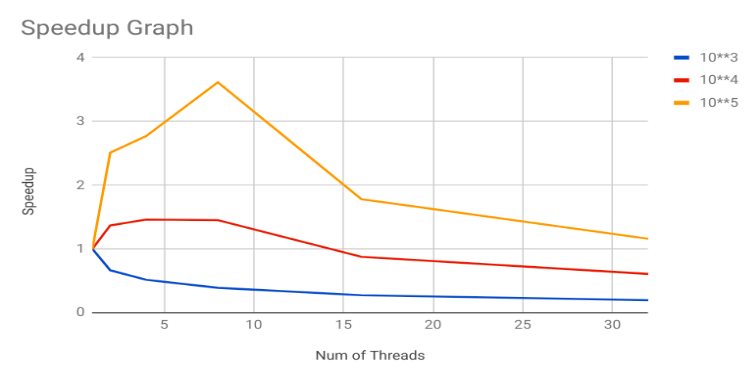

# ParaFind

- A shared memory implementation of lookup in a semi-ordered matrix using openMP threads.

## Aim

- Parallelizing search in a semi-ordered matrix using divide and conquer technique in PRAM model to achieve speedup and scalability.

## Traditional Divide and Conquer technique

- The conventional sequential Divide and Conquer algorithm reduces the search space by dividing the problem into 3 (usable) sub-problems of ¼ size each. These sub-problems are further solved by dividing them further.

## New method

- Our method is a parallel divide and conquer inspired by the serial walk algorithm. The serial walk explores what we call, a path.
- When the matrix is traversed along lines parallel to the major diagonal, we observe presence of cells which go from being less than query to being greater than the query. We call these cells as transition cells (these cells can be found in any row, column or diagonal using a single binary search). The collection of these transition cells make an arc across the matrix.
- The query is bound to lie on this arc for obvious reasons. In the worst case this arc will be of size 2 * n(where n is the dimension of matrix). Localising every element of this arc and then using a search is a costly task. We instead use a series of binary searches to reduce the search space significantly.
- To start the reduction of the search space, the top-right and bottom-left corners are helpful. Depending upon whether they are Lesser or Greater than the given query, the search begins on a combination of row and column pair. The divide and conquer begins after this initial step.
	- (L, L) ⇒ search top row and leftward column
	- (L, G) ⇒ search both the topmost and bottommost rows
	- (G, L) ⇒ search both the leftward and rightward columns
	- (G, G) ⇒ search the bottom row and the rightward column.

## Divide Step (and Trivial Conquer step)

- Divide the problem into two sub-problems by finding the transition cell in the middle row of the search space. Now the mid transition cell becomes the new top-right corner point for one space and bottom left corner point for the other.
- This step is continued till the base case is reached. The size base case is fine tuned to achieve the best performance. The base case is executed serially on each thread, it helps balance out the serial execution and improve the processor utilization.
- When the base case is reached, the serial walk algorithm is used to search for the query.

## Asymptotic Analysis

- The search space is reduced to two more search spaces of half the size. The additional overhead for identifying the subproblems is a binary search operation.
- T(n) = 2 * T(n/2) + log(n) ⇒ T(n) = O(n)

## Result

- Time is specified in seconds.

| Number of Threads / Size of input (10 ^ x) : x | 3 | 4 | 5 |
|:---:|:---:|:---:|:---:|
| 1 | 0.000656 | 0.178207 | 11.5179164 |
| 2 | 0.000986 | 0.130130 | 4.5870631 |
| 4 | 0.001272 | 0.121982 | 4.1587933 |
| 8 | 0.001679 | 0.122782 | 3.1873924 |
| 16 | 0.002400 | 0.203116 | 6.4669829 |
| 32 | 0.003329 | 0.293175 | 9.9419043 |




### Analysis

- This was an attempt to parallelize the serial walk algorithm for Find in a semi-ordered matrix. Our algorithm runs several orders faster than the traditional divide and conquer approach. However we have failed to demonstrate the desired scalability for smaller values. 

- On larger input sizes the performance improves slightly which might indicate that on even much larger inputs even this algorithm might be scalable. This could be because that the thread overheads are way more than the computation in this algorithm. However we cannot not verify this claim without testing on even larger input sizes.

## Compilation and Running

- For compiling the code
	- `make compileAll`
- For running the program on `num` threads
	- `make run t=num`
- For generating the testcase of order `order`
	- `make testcase d=order`
- Example
```bash
	$ make compile
	$ make testcase d=4
	$ make run t=8
```

## Underlying Architecture

- The program was thoroughly tested and optimized for a PRAM shared memory model which internally uses pThreads as primary units of computations.

# Dependencies

- gcc 5.4.0
- OpenMP Threads

# Authors

- [Abhishek V Joshi](https://github.com/jbnerd)
- [Shyamal Vaderia](https://github.com/svaderia)
- [Arka Talukdar](https://github.com/atalukdar)

